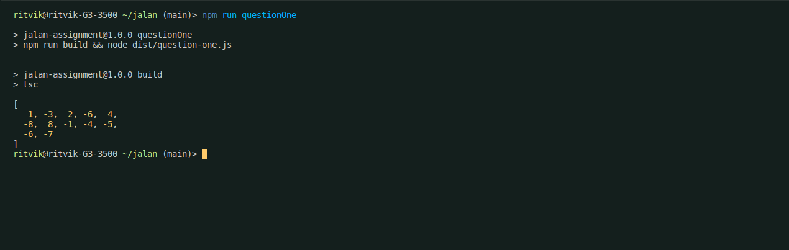
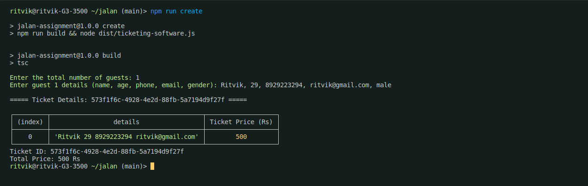
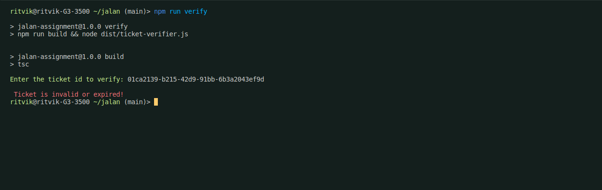
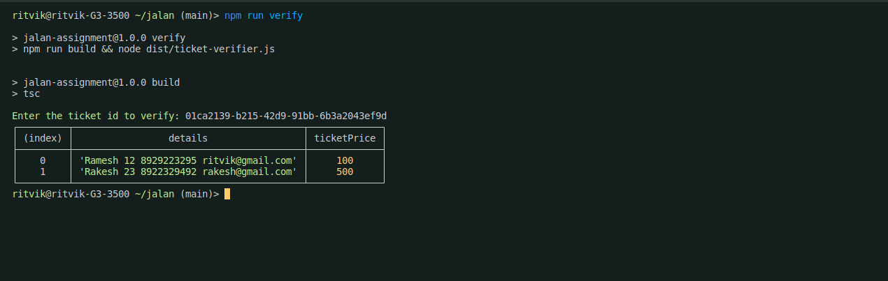
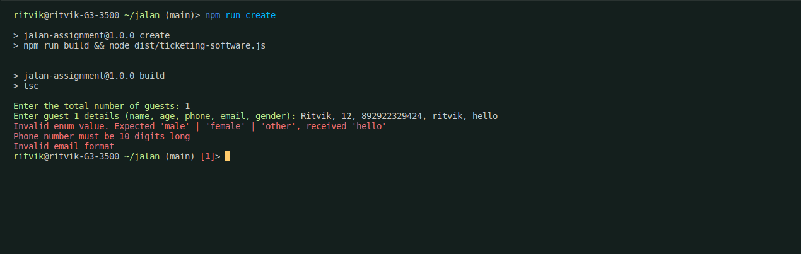

# Zoo Ticketing Software

This project is a Zoo Ticketing software built using Object-Oriented Programming (OOP) principles in Typescript. It provides a convenient way to manage ticket sales for a zoo, integrating various features for validation, user interface enhancement, and data management.

| Label          | Screenshot                                 |
|----------------|--------------------------------------------|
| Question One   |  |
| Ticket Creation| |
| Expired        |        |
| Verification   | |
| Errors         |          |

## Features

1. **ZOD Validations:**
   - The software implements ZOD validations to ensure that the data entered meets specified criteria, maintaining data integrity and preventing errors.

2. **Chalk:**
   - Chalk is utilized to enhance the command line interface by adding colors and styles, improving readability and user experience.

3. **Process Package:**
   - The `process` package is employed for handling standard input and output operations, facilitating user interaction through the command line interface.

4. **UUID Generation:**
   - UUID (Universally Unique Identifier) generation is integrated into the software for creating unique identifiers for tickets or transactions, ensuring uniqueness and integrity of data.

5. **Ticket Verification:**
   - The software provides a feature to verify tickets using UUID. Users can input the UUID of a ticket to check its validity.

6. **Ticket Expiry Check:**
   - It also includes functionality to check if a ticket is expired, providing users with relevant information about the validity of their tickets.

7. **JSON Data Storage:**
   - The software utilizes JSON format for storing transaction history, providing a structured and easily manageable data storage solution.

### Installation

1. Clone the repository:

   ```
   git clone https://github.com/shuklaritvik06/jalan-assignment
   ```

2. Navigate to the project directory:

   ```
   cd jalan-assignment
   ```

3. Install dependencies:

   ```
   npm install
   ```

### Usage

1. Question One:

```bash
npm run questionOne
```

2. Ticket Creation:

```bash
npm run create
```

3. Ticket Verification:

```bash
npm run verify
```

### License

This project is licensed under the [MIT License](LICENSE).
